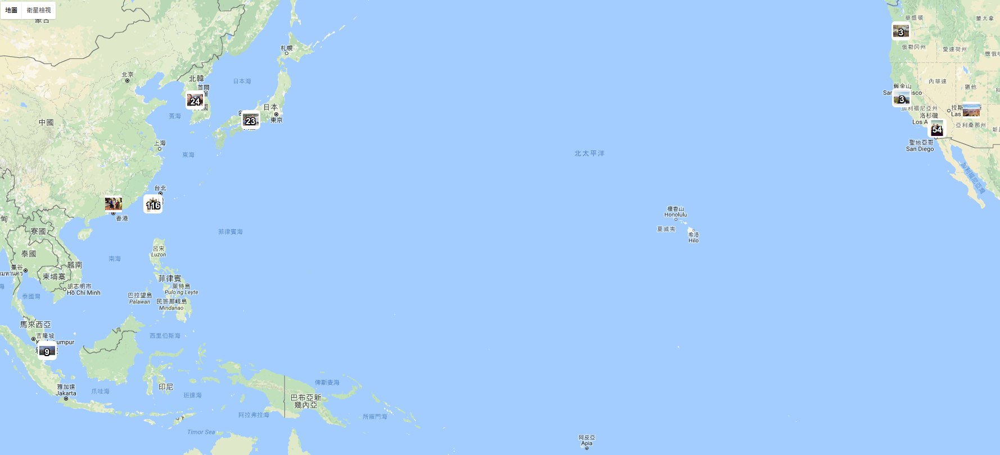
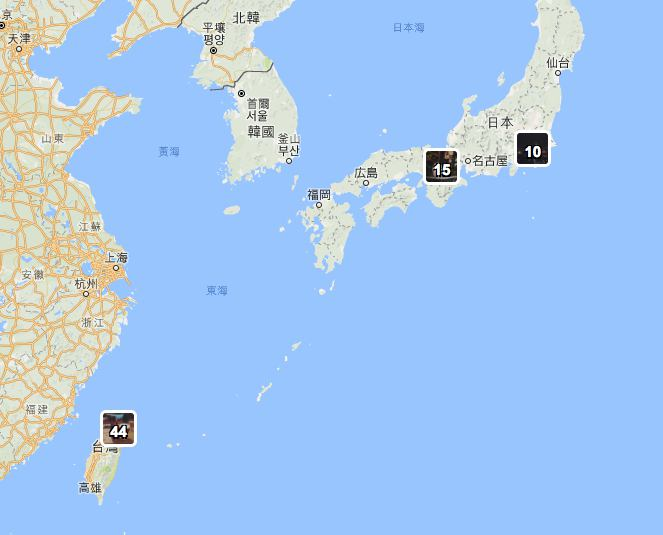

# Instagram-Map

This application used Instagram API and Google Maps API to build the Instagram Media Map. It allows people to log in via Instagram and loads the multiple check-in locations on the google map.

After login to Instagram, Instagram Map will try to load your media location. When finishing the loading procedure, Your Instagram Map will show up.

There are two little further functions:
1. You are able to click on the cluster to get detail location.
2.Click on the single photo, it will show the detail of this post.

For example: 

You can zoom in / zoom out:

Also, you are able to click on the figure to show more detail content.

Here is the [demo] (https://idea.cs.nthu.edu.tw/~yenhao0218/insta_map)
